# termux-deepseek

## 概述
termux-deepseek是一款专为 Termux 移动终端优化的 DeepSeek AI 命令行客户端，具有以下特点：
- 🚀 基于SiliconFlow API 的DeepSeek轻量级实现
- 📱 为移动终端特别优化显示效果
- 📝 支持 Markdown 格式的富文本交互
- 📂 内置智能日志管理系统
- ⚡ 提供流式响应和上下文对话功能

## 文件结构说明
```
termux-deepseek/
├── main.py            # 主程序入口
├── chat_session.py    # 对话会话管理
├── cli_parser.py      # 命令行参数处理
├── config.py          # 配置管理系统
├── display_utils.py   # 显示渲染引擎
├── log_utils.py       # 日志处理系统
└── .env       # 环境变量
```

## 核心Python依赖
```text
requests>=2.31.0       # HTTP请求库
pygments>=2.16.1       # 代码高亮
termcolor>=2.3.0       # 终端颜色渲染
python-dotenv>=1.0.0   # 环境变量管理
rich>=13.6.0           # 富文本终端输出（可选）
typing-extensions>=4.0 # 类型提示支持
```

### 完整安装
```bash
pip install -U requests pygments termcolor python-dotenv rich mypy black ruff
```

## 配置SiliconFlow API
### 配置环境变量
```bash
# .env 文件
SILICONFLOW_API_KEY="your_api_key_here"
```

## 核心模块详解

### 1. main.py - 主控模块
**功能**：
- 程序入口和主循环
- 用户输入/输出处理
- 日志系统初始化
- 模块间协调

**关键特性**：
- 彩色终端提示符
- 键盘中断处理
- 流式响应拼接
- 交互状态管理

### 2. chat_session.py - 会话核心
**API 功能**：
```python
class ChatSession:
    def __init__(self, config_overrides): ...  # 初始化会话
    def stream_chat(self, user_input): ...    # 流式对话处理
```

**技术亮点**：
- 自动维护对话上下文（保留最近10轮）
- 双重超时机制（连接10s/读取30s）
- 自动 API 错误处理

### 3. cli_parser.py - 参数解析
**支持参数**：
```bash
python main.py \
    --model deepseek-ai/DeepSeek-V3 \
    --max-tokens 2048 \
    --temperature 0.7
```

**参数说明表**：
| 参数 | 类型 | 默认值 | 说明 |
|------|------|--------|------|
| --model | str | deepseek-ai/DeepSeek-V3 | 模型版本选择 |
| --max-tokens | int | 8000 | 响应长度限制 |
| --temperature | float | 0.7 | 生成随机性 |

### 4. display_utils.py - 渲染引擎
**Markdown渲染**：
- 代码块： 自动识别，默认为Python语法高亮
- 表格：自动对齐
- 标题：色彩加粗
- 等等

**流式处理特点**：
- 智能缓冲机制
- 即时渲染优化
- ANSI 颜色代码支持
- 响应式布局

### 5. config.py - 配置中心
**配置优先级**：
1. 命令行参数
2. .env 文件
3. DEFAULT_CONFIG

**环境变量要求**：
```ini
# 必须设置
SILICONFLOW_API_KEY=your_api_key_here

# 可选覆盖
API_URL=https://your.endpoint
MODEL=deepseek-ai/DeepSeek-V2
```

### 6. log_utils.py - 日志系统
**日志管理功能**：

```mermaid
graph LR
A[新对话] --> B[自动清理7天前日志]
B --> C[写入UTF-8编码]
C --> D[保存对话日志]
D --> E[错误时备份到emergency.log]
```


**日志格式示例**：
```
用户: Python怎么用？
deepseek-ai/DeepSeek-V3: Python是一种...
--------------------------------------------------
```

## 扩展开发指南

### 添加新功能建议
1. 语音输入支持：
```python
# 在main.py中添加
if input_type == "voice":
    user_input = speech_to_text()
```

2. 多会话管理：
```python
# 扩展chat_session.py
class MultiSessionManager:
    def create_session(self): ...
    def switch_session(self): ...
```

3. 插件系统架构：
```
plugins/
├── translator.py
├── calculator.py
└── weather.py
```

---
